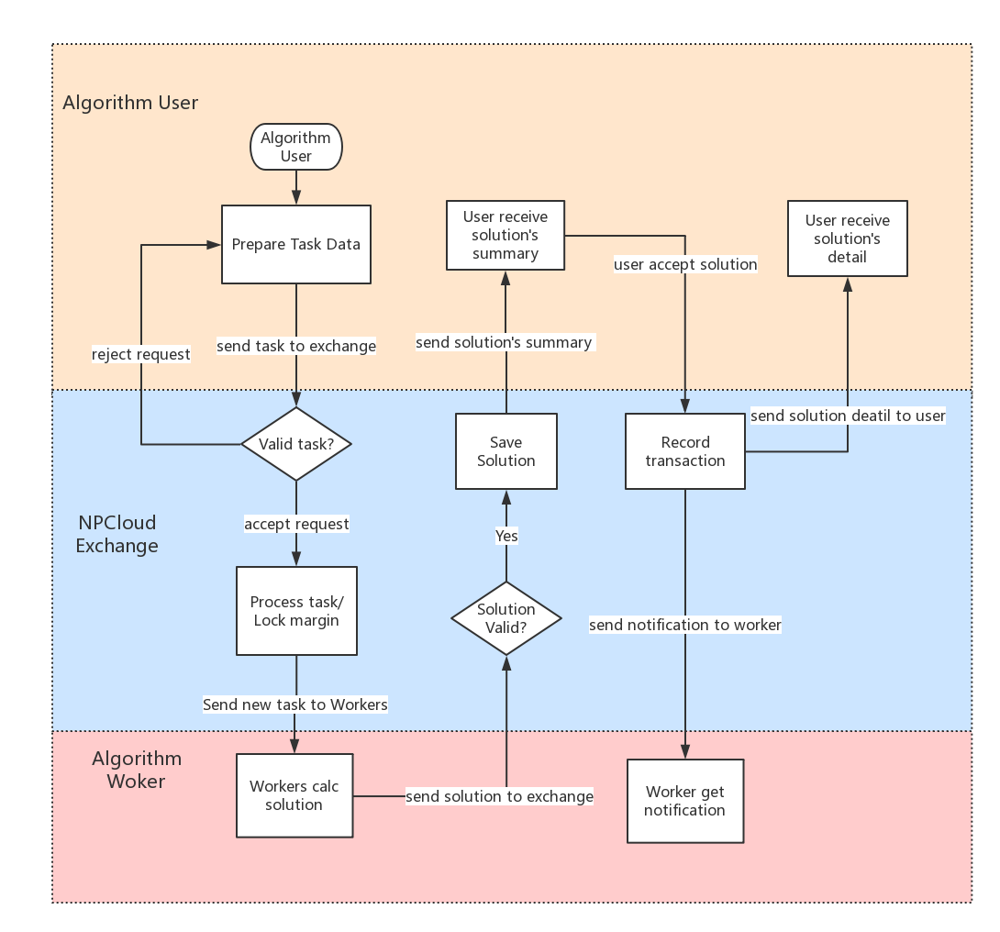

# Trading and Data API for NPCloud Exchange

NPCloud REST API provide interface for user to submit optimization task,
to submit solution for task, and to query task/solution data.



# General API Information
* The base endpoint is: **https://api.npcloud.io**
* All endpoints return either a JSON object or array.
* Data is returned in **descending** order in most case. Newest first, oldest last.
* All time and timestamp related fields are in milliseconds.
* Any endpoint can return an ERROR message; the error payload is as follows:
```javascript
{
  "code": -1002,
  "msg": "UNAUTHORIZED"
  "data" : {}
}
```

* When endpoint process your request successfully, the payload data will return directly
* Specific error codes and messages defined in later int the document (see **error** section).
* For `GET` endpoints, parameters must be sent as a `query string`.
* For `POST`, `PUT`, and `DELETE` endpoints, the parameters should be sent in the `request body` with content type
  `application/x-www-form-urlencoded`.
* Parameters may be sent in any order.

# Security check
* Any request need to contain three extra headers,
 **API key**,  **random number** and  **signature**. API key is passed via Http header `X-NPC-APIKEY`, signature via "X-NPC-API_SIGN", random number via "X-NPC-API_RANDOM"
* Signature is a sha-256 hash of API-key + API-secret + Random Number. For example, if your API key is "test", API secret is "secret", random number is 10, then signature is sha-256("testsecret10")
* User's API key and secret is assigned when user is registered on npcloud.io website
* API-keys and secret-keys **are case sensitive**.


## General endpoints
### Test connectivity
```
GET /api/v1/ping
```
Test connectivity to the Rest API.


**Parameters:**
NONE

**Response:**
```javascript
{}
```

### Check server time
```
GET /api/v1/time
```
Test connectivity to the Rest API and get the current server time (GMT time).


**Parameters:**
NONE

**Response:**
```javascript
{
  "serverTime": 1499827319559
}
```

### Contracts information
```
GET /api/v1/contracts
```
Current trading contracts


**Parameters:**
NONE

**Response:**
```javascript
{
  "contracts": ["VPRContract", "DemoContract"]
}
```

## Trading endpoints
### New task
```
POST /api/v1/task
```
Send in a new task. Notice,  "taskDetail" object's format is not defined here in this document, but in
 [npcloud-algorithm](https://github.com/npcloud/npcloud-algorithms)


**Parameters:**
```javascript
{
  "clientTaskId": "111",
  "contract": "DemoContract",
  "expireTime": 0,
  "price": 0.1,
  "taskDetail": {
     "left": 1,
    "right": 2
  }
}
```

[1] **clientTaskId**: unique task id given by client, optional

[2] **contract**: algorithm name, required

[3] **expireTime**: task's live time in seconds, default 1800. Value 0 mean task has no expiration time

[4] **price**: price cannot be less than zero, required

[5] **taskDetail**: taskDetail is optimization's input parameters, required


**Response:**
```javascript
{
  "tid": "TASK_6370595067689697280",
  "contract": "DemoContract",
  "status": "SUBMITTING",
  "createUser": 1,
  "createTime": 1518868224070,
  "lastUpdateTime": 1518868224070,
  "price": 0.1,
  "expireTime": 1518870024068,
  "solutionIds": []
}
```

[1] **tid**: task id given by exchange

[2] **status**: Task status can be one of SUBMITTING, REJECTED, SUBMITTED, CLOSED.
SUBMITTING means task is received by exchange and is under processing.
SUBMITTED means task is saved and published by exchange. REJECTED means task
is invalid and is rejected by exchange. CLOSED is the status after task owner
close the task, and then no more solution can be sent to task.

[3] **createTime**: unix timestamp that record the create time of task

[4] **solutionIds**: solutionIds is an array contains all valid solution id for this task
the

### Close Task
```
POST /api/v1/close_task
```
Task owner try to close an active task. New solution will not be submitted to task.
Task is closed successfully when all pending solutions are processed.

**Parameters:**

Name | Type | Mandatory | Description
------------ | ------------ | ------------ | ------------
tid | STRING | NO | task id

**Response:**
```javascript
{
  "tid": "TASK_6370525770497916928",
  "contract": "DemoContract",
  "status": "CLOSED",
  "createUser": 1,
  "createTime": 1518851702332,
  "lastUpdateTime": 1518869937824,
  "price": 0.1,
  "expireTime": 1518853502320,
  "solutionIds": []
}
```


### Publish Solution
```
POST /api/v1/solution
```
User publish solution for certain task. After solution is verified by exchange,
task owner will get notification from stream channel.

Field "solutionDetail" is not defined here in this document but in [npcloud-algorithm](https://github.com/npcloud/npcloud-algorithms)


**Parameters:**

```javascript
{
  "clientSolutionId": "112",
  "contract": "DemoContract",
  "price": 0.1,
  "solutionDetail": {
    "sum": 3
  },
  "taskId": "TASK_6370582750918868992"
}
```

[1] **clientSolutionId** : solution id given by client, required

[2] **contract**: algorithm name, required

[3] **price**: price cannot be less than zero, required

[4] **solutionDetail** : the output object of the optimization algorithm, required

[5] **taskId**: target task of the solution


**Response:**
```javascript
{
  "tid": "TASK_6370582750918868992",
  "sid": "SOL_6370594900236304384",
  "contract": "DemoContract",
  "status": "SUBMITTING",
  "price": 0.1,
  "createTime": 1518868184146,
  "objectives": null,
  "createUser": 2
}
```

[1] **status**: Solution status can be one of SUBMITTING, SUBMITTED, REJECTED, ACCEPTED.
SUBMITTING means the solution is received by exchange and is under processing.
SUBMITTED means solution passes the verification. REJECTED mean solution is invalid.
ACCEPTED means the solution is accepted by the algorithm user.

### Task owner accept Solution
```
POST /api/v1/accept_solution
```

Task's owner can accept a valid solution, exchange will return solution's detail
and deduct token from owner's balance.

Notice, task owner can query detail solution later by using the /solution_info api call.

**Parameters:**

Name | Type | Mandatory | Description
------------ | ------------ | ------------ | ------------
sid | STRING | NO | Solution Id

**Response:**
```javascript
{
  "tid": "TASK_6370582750918868992",
  "sid": "SOL_6370597756976758784",
  "contract": "DemoContract",
  "status": "ACCEPTED",
  "price": 0.1,
  "createTime": 1518868865246,
  "objectives": { "result": 3 }
  "solutionDetail": {
    "sum" : 3
  },
  "createUser": 2
}
```


## Data endpoints
### Query all live tasks

```
GET /api/v1/live_tasks
```
Query all living tasks by contract symbol.


**Parameters:**

Name | Type | Mandatory | Description
------------ | ------------ | ------------ | ------------
contract | STRING | YES | contract symbol
limit | INT | NO | Default 100; max 1000.
page | INT | NO | Page number

**Caution:** setting limit=0 will return all living tasks.

**Response:**
```javascript
[{
     "tid": "TASK_6370582750918868992",
     "contract": "DemoContract",
     "status": "SUBMITTED",
     "createUser": 1,
     "createTime": 1518865287523,
     "lastUpdateTime": 1518865287586,
     "price": 0.1,
     "expireTime": 1518867087518,
     "solutionIds": [
       "SOL_6370589691506327552",
       "SOL_6370586865522704384",
       "SOL_6370583113004744704"
     ]
}]
```

[1] **solutionIds**: all valid  solution's (solution status in SUBMITTED, ACCEPTED) id for this task

### Query user's published tasks

```
GET /api/v1/published_tasks
```
Query current user's publish task, in another word, tasks owned by current user.

**Parameters:**

Name | Type | Mandatory | Description
------------ | ------------ | ------------ | ------------
contract | STRING | YES | contract symbol
limit | INT | NO | Default 100; max 1000.
page | INT | NO | Page number


**Caution:** setting limit=0 will return all user's tasks.

**Response:**
```javascript
[{
     "tid": "TASK_6370505683665682432",
     "contract": "DemoContract",
     "status": "CLOSED",
     "createUser": 1,
     "createTime": 1518846913258,
     "lastUpdateTime": 1518851202082,
     "price": 0.1,
     "expireTime": 1518848713257,
     "solutionIds": [
       "SOL_6370517052406366208"
     ]
}]
```

### Query user's solved tasks

```
GET /api/v1/solved_tasks
```
Query tasks which current user has published solutions for.

**Parameters:**

Name | Type | Mandatory | Description
------------ | ------------ | ------------ | ------------
contract | STRING | YES | contract symbol
limit | INT | NO | Default 100; max 1000.
page | INT | NO | Page number


**Caution:** setting limit=0 will return all user's tasks.

**Response:**
```javascript
[{
     "tid": "TASK_6370582750918868992",
     "contract": "DemoContract",
     "status": "SUBMITTED",
     "createUser": 1,
     "createTime": 1518865287523,
     "lastUpdateTime": 1518865287586,
     "price": 0.1,
     "expireTime": 1518867087518,
     "solutionIds": [
       "SOL_6370583113004744704",
       "SOL_6370586865522704384",
       "SOL_6370589691506327552"
     ]
}]
```

### Query task detail by task id

```
GET /api/v1/task_info
```

Query task by task Id, return task information and task's solution information.
Notice, solution's detail information is not given here, and please use /solution_info API
call to get solution's detail information.

**Parameters:**

Name | Type | Mandatory | Description
------------ | ------------ | ------------ | ------------
contract | STRING | YES | contract symbol
tid | STRING | YES | task id


**Caution:** setting limit=0 will return all living tasks.

**Response:**
```javascript
{
  "tid": "TASK_6370582750918868992",
  "contract": "DemoContract",
  "status": "SUBMITTED",
  "createUser": 1,
  "createTime": 1518865287523,
  "lastUpdateTime": 1518865287586,
  "price": 0.1,
  "expireTime": 1518867087518,
  "solutionIds": [],
  "solutions": [
    {
      "tid": "TASK_6370582750918868992",
      "sid": "SOL_6370583113004744704",
      "contract": "DemoContract",
      "status": "SUBMITTED",
      "price": 0.1,
      "createTime": 1518865373851,
      "objectives": {
                "result": 3
      }
      "createUser": 2
    }
  ],
  "taskDetail": {
    "left": 1,
    "right": 2
  }
}
```

### Query solution detail

```
GET /api/v1/solution_info
```

Query solution by solution id. Only solution's creator and solutions' acceptor
has the privilege to see solution's detail.

**Parameters:**

Name | Type | Mandatory | Description
------------ | ------------ | ------------ | ------------
sid | STRING | YES | solution id


**Response:**
```javascript
{
  "tid": "TASK_6371239830277324800",
  "sid": "SOL_6371244653529792512",
  "contract": "DemoContract",
  "status": "ACCEPTED",
  "price": 0.1,
  "createTime": 1519023097403,
  "solutionDetail": {
    "sum": 3
  },
  "objectives": {
    "sum": 3
  },
  "createUser": 2
}
```


### Account information
```
GET /api/v1/account
```
Get current account information.

**Parameters:**

**Response:**
```javascript
{
  "balances": [
    {
      "asset": "NPC",
      "free": "4723846.89208129",
      "locked": "0.00000000"
    }
  ]
}
```


## Error codes for NPC rest API
Errors consist of three parts: an error code, a message and a detail
 message optionally. Codes are universal,
 but messages can vary. Here is the error JSON payload:
```javascript
{
  "code":-1121,
  "msg":"Invalid contact.",
  "detail": {}
}
```

### 200 - Success Request

### 10xx - General Server or Network issues
#### -1000 UNKNOWN
 * An unknown error occured while processing the request.

#### -1001 DISCONNECTED
 * Internal error; unable to process your request. Please try again.

#### -1002 UNAUTHORIZED
 * You are not authorized to execute this request.

#### -1003 TOO_MANY_REQUESTS
 * You have sent too many requests.

#### -1007 TIMEOUT
 * Timeout waiting for response from backend server. Send status unknown; execution status unknown.

#### -1013 INVALID_MESSAGE
 * INVALID_MESSAGE

#### -1016 SERVICE_SHUTTING_DOWN
 * This service is no longer available.

#### -1020 UNSUPPORTED_OPERATION
 * This operation is not supported.

#### -1100 ILLEGAL_CHARS
 * Illegal characters found in a parameter.

#### -1101 TOO_MANY_PARAMETERS
 * Too many parameters sent for this endpoint.
 * Duplicate values for a parameter detected.

#### -1102 MANDATORY_PARAM_EMPTY_OR_MALFORMED
 * A mandatory parameter was not sent, was empty/null, or malformed.
 * Mandatory parameter '%s' was not sent, was empty/null, or malformed.

#### -1103 UNKNOWN_PARAM
 * An unknown parameter was sent.

#### -1105 PARAM_EMPTY
 * A parameter was empty.

#### -1106 INVALID_LISTEN_KEY
 * This listenKey does not exist.


### 20xx - Processing Issues

#### -2001 NO_SUCH_CONTRACT
 * Contract does not exist.

#### -2002 CONTRACT_SUSPEND
* Contract is not enabled

### -2003 CONTRACT_CANNOT_LOAD
* Contract cannot be load when processing task

#### -2004 USER_NOT_FOUND
 * Request's user cannot be found

#### -2005 STREAM_KEY_NOT_FOUND
 * Stream key cannot be found when subscribing stream

#### -2006 BUY_PRICE_INVALID
 * Task's price is must be large than 0

#### -2007 INVALID_CONTRACT_SETTING
 * Task's detail setting is not valid

#### -2009 BALANCE_NOT_ENOUGH
 * User's balance is not enough to support trading

#### -2010 NO_SOLUTION_FOUND
  * Solution is not found to support following process

#### -2011 SOLUTION_HAS_ACCEPTED
  * Solution is already be accepted, but user try to accept it again

#### -2012 SOLUTION_IS_REJECTED
 * Solution is rejected but user try to accept it

#### -2013 UNAUTHORIZED_ON_SOLUTION
 * User try to accept a solution without permission

#### -2014 DUPLICATE_LOCK
 * User try to lock a balance twice

#### -2015 LOCK_NOT_FOUND
 * User try to lock a un-existing lock

#### -2016 BALANCE_NOT_FOUND
 * User's balance is not found

#### -2017 SELF_TRADING
 * User try to publish solution on its own's task

#### -2018 SELL_PRICE_INVALID
 * Solution's price setting in not valid

#### -2019 INVALID_SOLUTION
 * Solution information is not valid

#### -2020 NO_TASK_FOUND
 * Task cannot be found

#### -2021 TASK_HAS_CLOSED
 * Task is already closed

#### -2023 DUPLICATE_CLIENT_TASK_ID
 * User's specified task id is duplicate

#### -2024 DUPLICATE_CLIENT_SOLUTION_ID
 * User's specified solution id is duplicate